# Machine Learning Assisted Multi-Objective Optimization of ABS–Glass Fiber FDM Process Parameters

## Overview

This repository presents a comprehensive machine learning-based framework for predicting, interpreting, and optimizing the performance of **ABS–glass fiber reinforced fused deposition modeling (FDM)** additive manufacturing processes.

The developed framework integrates:

- Experimental data analysis
- Design of Experiments (DOE)
- Virtual design space exploration
- Machine learning-based surrogate modeling
- Explainable Artificial Intelligence (XAI)
- Global sensitivity analysis
- Uncertainty-aware optimization
- NSGA-II multi-objective optimization

The main objective of this research is to establish a data-driven approach for understanding the complex relationship between FDM process parameters and final part performance, specifically:

1. Improving tensile strength
2. Reducing surface roughness
3. Identifying critical manufacturing parameters
4. Determining optimal processing conditions

---

# Research Workflow

The complete computational workflow consists of sequential stages:

**Experimental Dataset**

↓

**Data Cleaning and Statistical Analysis**

↓

**Design Space Exploration using DOE**

↓

**Machine Learning Model Development**

↓

**Model Interpretation using Explainable AI**

↓

**Global Sensitivity Analysis**

↓

**Multi-objective Optimization using NSGA-II**

↓

**Robust Pareto-optimal Process Selection**

---

# Research Objectives

The major objectives of this project are:

### 1. Predictive Modeling

Develop accurate machine learning models for:

- Tensile strength prediction
- Surface roughness prediction

### 2. Process Parameter Understanding

Identify the influence of major FDM parameters:

- Glass fiber content
- Infill density
- Layer thickness
- Nozzle temperature
- Bed temperature
- Printing speed

### 3. Explainable AI Integration

Improve model transparency using:

- SHAP feature importance
- Partial dependence analysis
- Feature contribution analysis

### 4. Optimization

Determine optimal processing conditions by simultaneously:

- Maximizing tensile strength
- Minimizing surface roughness

---

# Dataset and Design Space Analysis

The framework considers experimentally relevant FDM process parameters covering a wide manufacturing design space.

## Experimental Design Space Coverage

The parameter space was systematically explored to ensure sufficient representation of possible processing conditions.

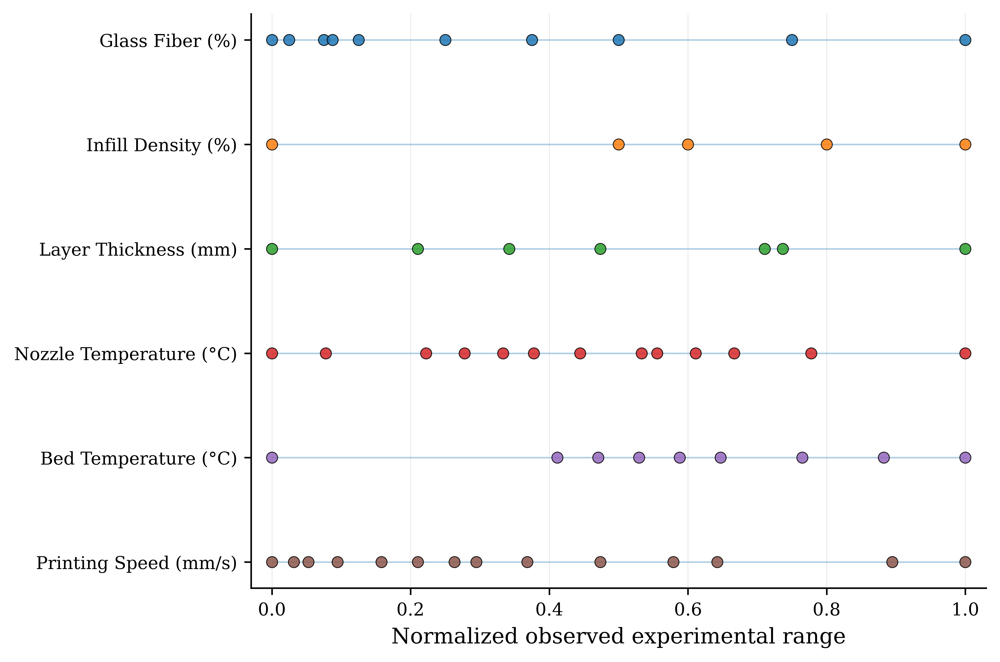

## Sampling Quality and Parameter Independence

The generated design space was evaluated using correlation analysis to ensure independent and well-distributed sampling.

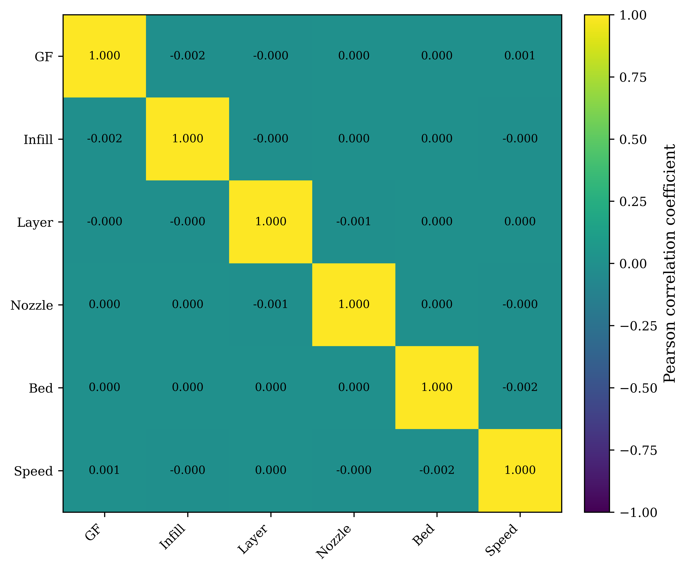

---

# Response Characteristics Analysis

Understanding response distribution is essential before developing predictive models.

## Tensile Strength Distribution

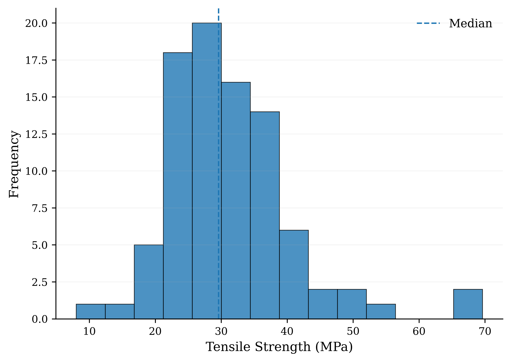

## Surface Roughness Distribution

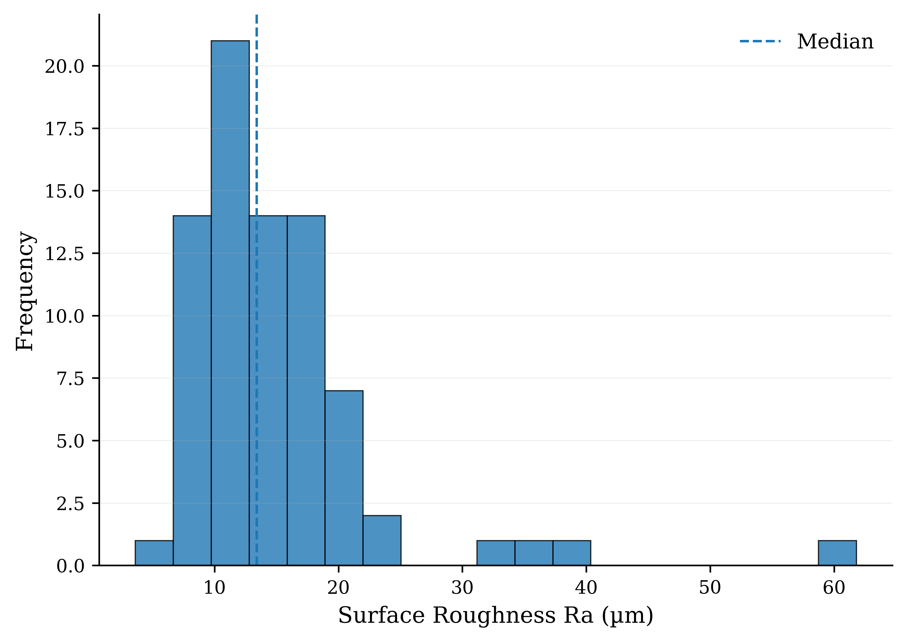

---

# Machine Learning Based Predictive Modeling

Multiple machine learning algorithms were evaluated to establish reliable surrogate models for FDM performance prediction.

The evaluated models include:

- XGBoost
- LightGBM
- CatBoost
- Extra Trees
- Random Forest
- Gradient Boosting
- Support Vector Regression
- Neural Network Models

Model performance was evaluated using:

- R² score
- RMSE
- MAE
- Cross-validation performance

---

# Tensile Strength Prediction Performance

The relationship between experimentally observed and model-predicted tensile strength values demonstrates the predictive capability of the developed machine learning framework.

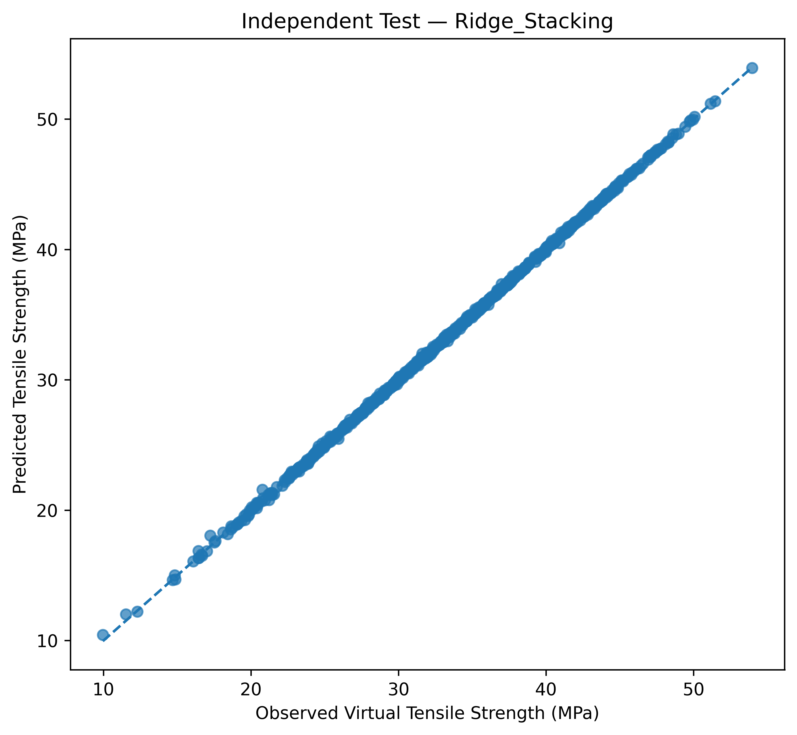

---

# Surface Roughness Prediction Performance

The developed models successfully captured the nonlinear relationship between printing parameters and surface quality.

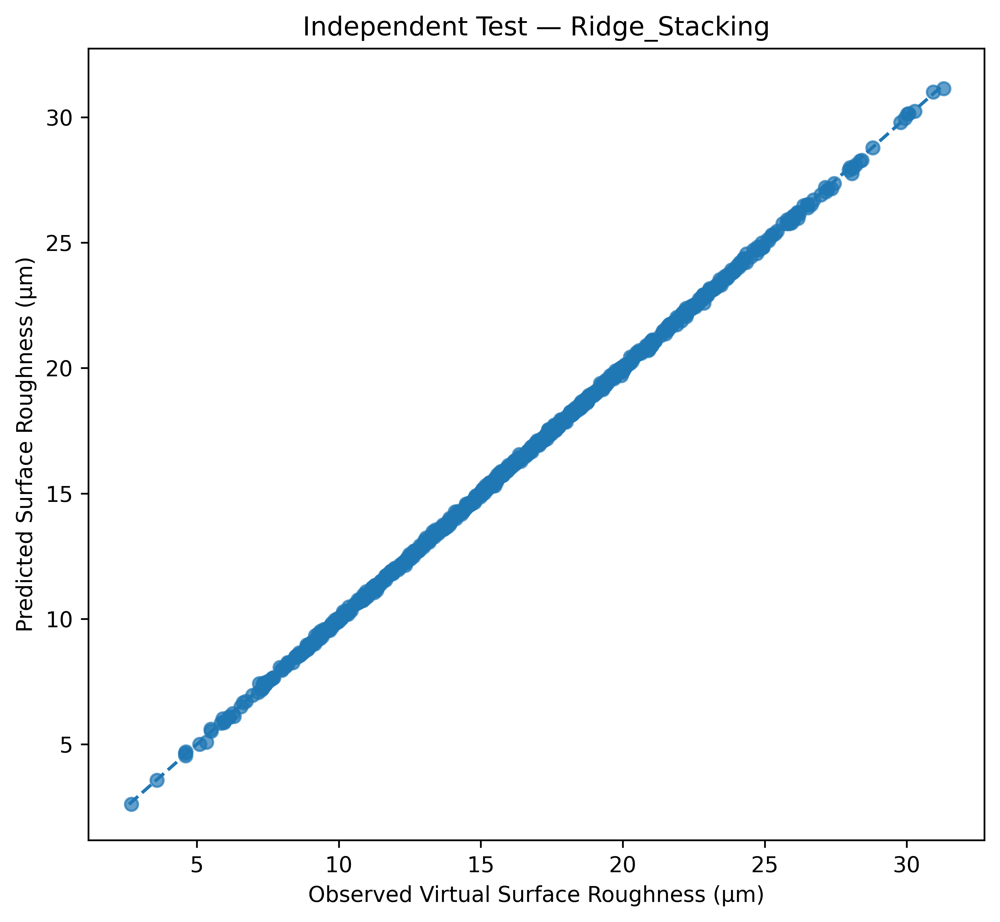

---

# Explainable Artificial Intelligence (XAI)

Although machine learning models provide high prediction accuracy, understanding the underlying decision mechanism is essential.

Therefore, SHAP-based explainability analysis was performed to identify the contribution of individual process parameters.

## Tensile Strength Feature Contribution

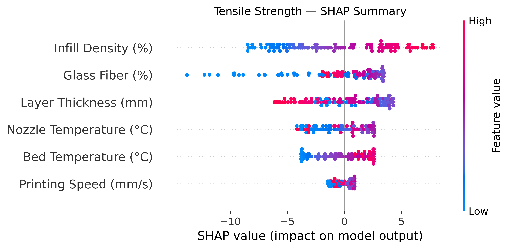

## Surface Roughness Feature Contribution

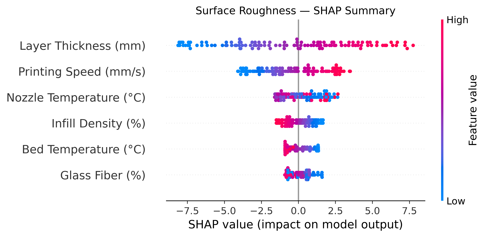

---

# Global Sensitivity Analysis

Global sensitivity analysis was conducted using the Sobol method to quantify:

- Individual parameter effects
- Total parameter influence
- Parameter interactions

## Tensile Strength Sensitivity

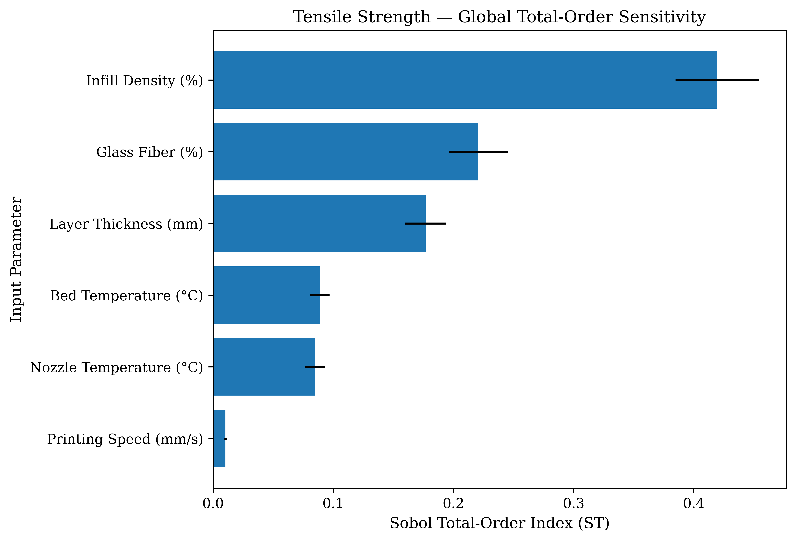

## Surface Roughness Sensitivity

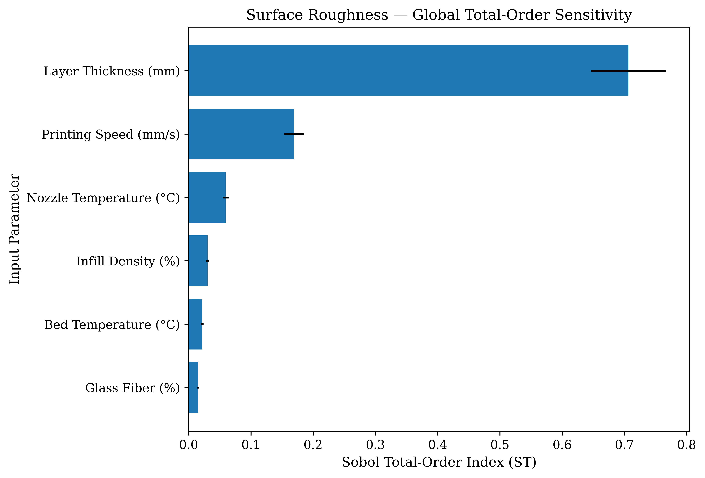

---

# Multi-Objective Optimization Framework

Since tensile strength improvement and surface roughness reduction represent competing objectives, a multi-objective optimization strategy was adopted.

The optimization objectives were:

### Objective 1:

Maximize tensile strength

### Objective 2:

Minimize surface roughness

The NSGA-II evolutionary optimization algorithm was applied to obtain Pareto-optimal solutions.

---

# Nominal Pareto Optimization

The Pareto front represents the trade-off between mechanical performance and surface quality.

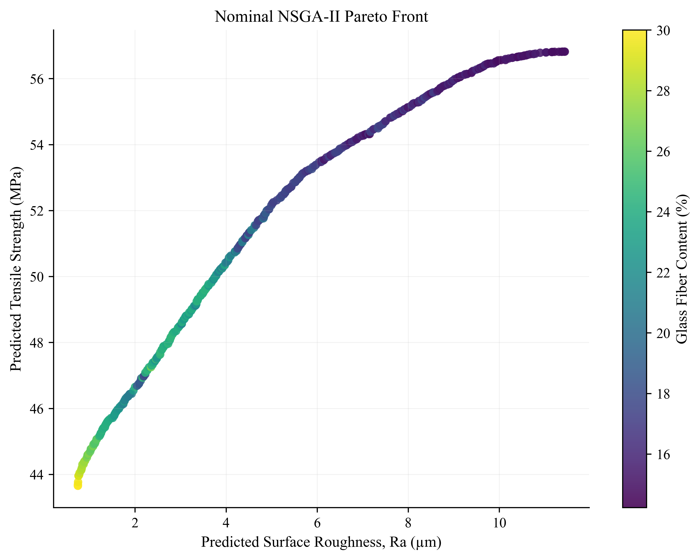

---

# Robust Optimization and Decision Making

To consider practical manufacturing uncertainty, robust optimization was performed.

A TOPSIS-based decision framework was applied to identify the most balanced process conditions among Pareto-optimal solutions.

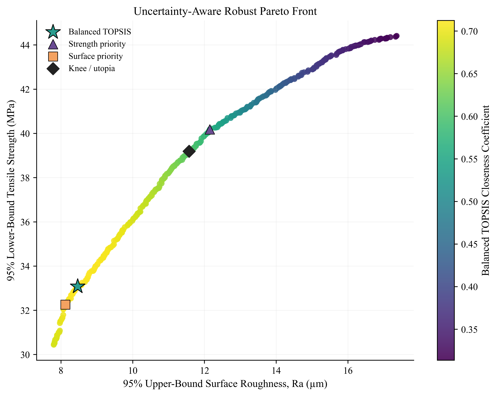

---

# Recommended Process Parameters

The final optimized parameter profiles provide practical guidance for selecting FDM processing conditions.

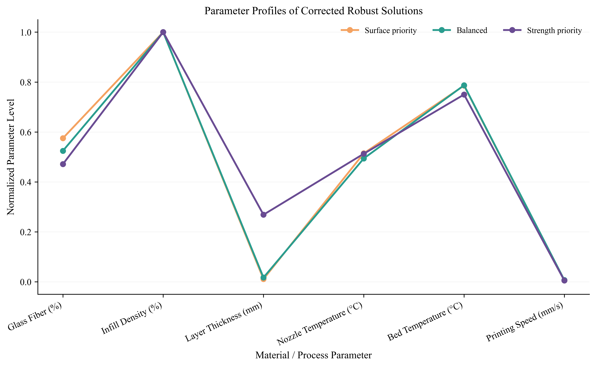

---

# Repository Structure

---

# Technologies Used

## Programming

- Python

## Machine Learning

- Scikit-learn
- XGBoost
- LightGBM
- CatBoost

## Explainable AI

- SHAP
- Feature importance analysis

## Sensitivity Analysis

- Sobol analysis (SALib)

## Optimization

- NSGA-II evolutionary optimization

---

# Research Contribution

This project demonstrates an integrated framework combining machine learning prediction, explainable AI, sensitivity analysis, and multi-objective optimization for advanced additive manufacturing process design.

The proposed workflow enables:

- Accurate performance prediction
- Identification of critical manufacturing parameters
- Transparent interpretation of machine learning models
- Data-driven optimization of FDM processing conditions

---

# Future Extension

Future work includes:

- Experimental validation of optimized parameters
- Integration with real-time manufacturing monitoring
- Physics-informed machine learning development
- Extension to other composite additive manufacturing materials

---

# Author
Apurbo Das
Dhaka University of Engineering & Technology
Department of Industrial and Production Engineering (IPE)
linkedin.com/in/apurbodas
apurbodasipe@gmail.com

3D Printing Enthusiast | Additive Manufacturing | Sustainable Filament Developer | Industrial Engineering | Machine Learning in Manufacturing
